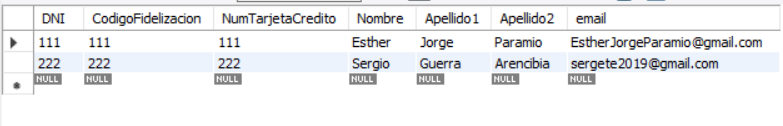

# Modelo lógico relacional

Esther Jorge Paramio

En este repositorio en la carpeta *CrearTablasSQL*  se encuentran los scripts de la práctica y los diseños realizado con workbench tanto de viveros como de catastro anterior de *ModeloLogicoRelacional* ya que estoy reutilizando el repositorio.


# Triggers

#### Dada la base de dato de viveros:
- Procedimiento: crear_email devuelva una dirección de correo electrónico con el siguiente formato
  - Un conjunto de caracteres del nombe y/o apellidos
  - El carácter @.
  - El dominio pasado como parámetro.

Para este apartado, creamos un procedimineto llamado *crear_email*, tal y como pide el enunciado, al que
le mandamos como parámetros de entrada el nombre, el primer apellido, el segundo de la persona junto al dominio del correo y como parámetro de salida la variable *email* con el resultado.

Para crear el email del usuario, concatenamos, con la función *CONCAT* que recibe dos parámetros, el nombre y sus respectivos apeelidos
junto al arroba y el dominio del correo.

El *procedure* no hace *return* por lo que para obtener la variable de salida la mandamos como variable local.

```SQL
DELIMITER //

CREATE PROCEDURE `crear_email` (nombre VARCHAR(45), apellido1 VARCHAR(45), apellido2 VARCHAR(45), 
dominio VARCHAR(45), OUT email VARCHAR(45))
BEGIN
  SET email = CONCAT(nombre, apellido1);
  SET email = CONCAT(email, apellido2);
  SET email = CONCAT(email, '@');
	SET email = CONCAT(email, dominio);
END //

DELIMITER ;
```

- Una vez creada la tabla escriba un trigger con las siguientes características:
  - Se ejecuta sobre la tabla clientes.
  - Se ejecuta antes de una operación de inserción.
  - Si el nuevo valor del email que se quiere insertar es NULL, entonces se le creará automáticamente una dirección de email y se insertará en la tabla.
  - Si el nuevo valor del email no es NULL se guardará en la tabla el valor del email.

En este apartado, creamos un trigger sobre la tabla clientes antes de realizar un *insert* tal y como se indica en la cabecera del *trigger* y comprobamos si en cada columna la variable *email* es nula llamamos al procedimiento *crear_email* con los datos a insertar de la persona, por ello usamos la palabra reservada *NEW* y obtenemos como salida *emailOut*. Por último, igualamos el valor a insertar de la columna *email* del usuario el resultatado del procedimiento.
 
```SQL
DELIMITER //

CREATE DEFINER = CURRENT_USER TRIGGER `EmpresaViveros`.`trigger_crear_email_before_insert` BEFORE INSERT ON `CLIENTES_FIDELIZADOS` FOR EACH ROW
BEGIN
	IF NEW.email IS NULL THEN 
		CALL crear_email(NEW.Nombre, NEW.Apellido1, NEW.Apellido2, 'gmail.com', @emailOut);
        SET NEW.email = @emailOut;
    END IF;
END //

DELIMITER ;
```

Para comprobar el funcionamiento de ambos métodos, ejecutamos un *insert* al que desde un inicio no tenga correo y otro que si se le añada el correo desde el *insert* y mostramos las filas desde el workbench de la siguiente forma:

```SQL
INSERT INTO CLIENTES_FIDELIZADOS (DNI, CodigoFidelizacion, NumTarjetaCredito, Nombre, Apellido1, Apellido2, email) VALUES (111, 111,  111, 'Esther', 'Jorge', 'Paramio', NULL);

INSERT INTO CLIENTES_FIDELIZADOS (DNI, CodigoFidelizacion, NumTarjetaCredito, Nombre, Apellido1, Apellido2, email) VALUES (222, 222,  222, 'Sergio', 'Guerra', 'Arencibia', 'sergete2019@gmail.com');

SELECT * FROM CLIENTES_FIDELIZADOS;
```

Obteniendo el siguiente resultado en la tabla *CLIENTES_FIDELIZADOS*:



#### Crear un trigger permita verificar que las personas en el Municipio del catastro no pueden vivir en dos viviendas diferentes.

Para este apartado, creamos un *trigger* que se ejecutará sobre la tabla *PERSONA* a la que al hacer la insersención de una persona nueva comprobamos que se rellenan o bien las claves foráneas de *PISO* o de *UNIFAMILIAR* y no de ambas, ya que eso significaría que vive en ambas viviendas. Por lo que comprobamos que si todas estás variables contienen un valor entonces sale un mensaje de error evitando que se realice la inserción.

```SQL
DELIMITER //

CREATE DEFINER = CURRENT_USER TRIGGER `Catastro`.`trigger_no_viviendas_diferentes_before_insert` BEFORE INSERT ON `PERSONA` FOR EACH ROW
BEGIN
	IF NEW.PISO_Letra IS NOT NULL AND NEW.PISO_BLOQUE_CONSTRUCCION_idConstruccion IS NOT NULL AND NEW.PISO_Planta IS NOT NULL
	AND NEW.UNIFAMILIAR_CONSTRUCCION_idConstruccion IS NOT NULL AND NEW.UNIFAMILIAR_CONSTRUCCION_CALLE_Nombre IS NOT NULL THEN
		SIGNAL SQLSTATE '45000' SET MESSAGE_TEXT = 'Una persona no puede vivir en dos viviendas';
	END IF;
END //

DELIMITER ;
```

Comprobamos el funcionamiento del *trigger* con los siguientes *inserts*:

```SQL
INSERT INTO PERSONA (DNI, Nombre, PERSONA_DNI, unifamiliar, PISO_Letra, PISO_BLOQUE_CONSTRUCCION_IdConstruccion, PISO_Planta,
UNIFAMILIAR_CONSTRUCCION_idConstruccion, UNIFAMILIAR_CONSTRUCCION_CALLE_Nombre) VALUES (222, 'Sergio', 333, 'npi', 3, 1, 2, NULL, NULL);

INSERT INTO PERSONA (DNI, Nombre, PERSONA_DNI, unifamiliar, PISO_Letra, PISO_BLOQUE_CONSTRUCCION_IdConstruccion, PISO_Planta,
UNIFAMILIAR_CONSTRUCCION_idConstruccion, UNIFAMILIAR_CONSTRUCCION_CALLE_Nombre) VALUES (333, 'Vic', 222, 'npi', NULL, NULL, NULL, 1, 'holi');

INSERT INTO PERSONA (DNI, Nombre, PERSONA_DNI, unifamiliar, PISO_Letra, PISO_BLOQUE_CONSTRUCCION_IdConstruccion, PISO_Planta,
UNIFAMILIAR_CONSTRUCCION_idConstruccion, UNIFAMILIAR_CONSTRUCCION_CALLE_Nombre) VALUES (111, 'Esther', 222, 'npi', 3, 1, 2, 1, 'holi');
```

Obteniendo como resultado la inserción de las dos primeras personas y el mensaje de error al añadir la tercera:


