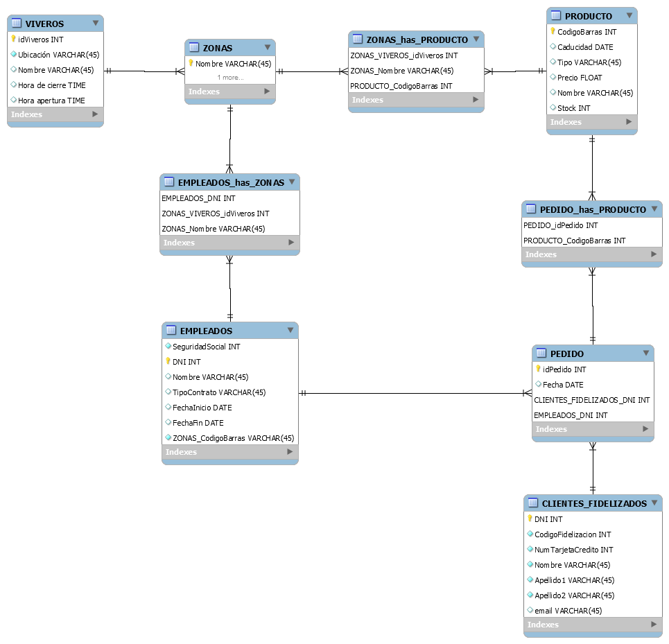
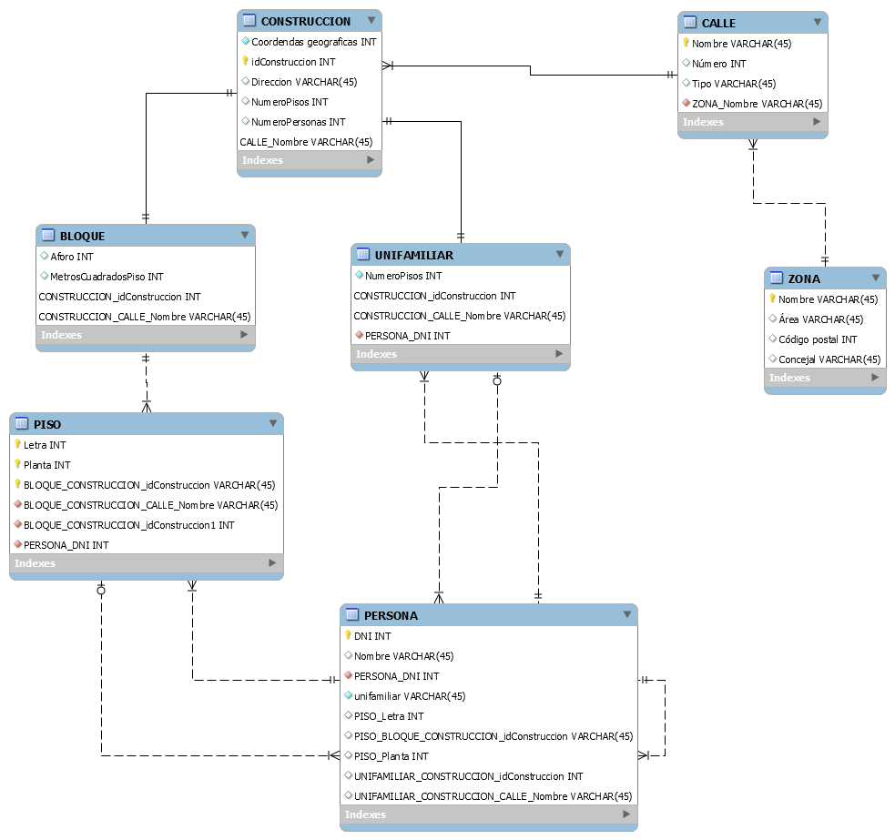
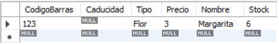
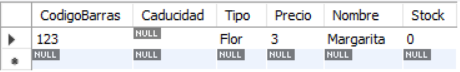
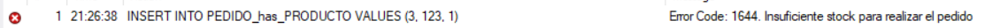

Esther Jorge Paramio

# Modelo lógico relacional

En este repositorio en la carpeta *CrearTablasSQL* se encuentran los scripts de esta práctica y los diseños realizado con workbench tanto de viveros como de catastro de *ModeloLogicoRelacional* ya que estoy reutilizando el repositorio.

## Modelo Relacional de Viveros



## Modelo Relacional de Catastro



# Triggers

#### Dada la base de dato de viveros:
- Procedimiento: crear_email devuelva una dirección de correo electrónico con el siguiente formato
  - Un conjunto de caracteres del nombe y/o apellidos.
  - El carácter @.
  - El dominio pasado como parámetro.

Para este apartado, creamos un procedimineto llamado *crear_email*, tal y como pide el enunciado, al que
le mandamos como parámetros de entrada el nombre, el primer y segundo apellido de la persona junto al dominio del correo además del parámetro de salida, el cual es una variable de usuario llamada *email* que contendrá el resultado.

Para crear el email del usuario, concatenamos el nombre, los apellidos y el dominio con la función *CONCAT*, la cual recibe dos parámetros a concatenar.

```SQL
CREATE PROCEDURE `crear_email` (nombre VARCHAR(45), apellido1 VARCHAR(45), apellido2 VARCHAR(45), 
dominio VARCHAR(45), OUT email VARCHAR(45))
BEGIN
  SET email = CONCAT(nombre, apellido1);
  SET email = CONCAT(email, apellido2);
  SET email = CONCAT(email, '@');
	SET email = CONCAT(email, dominio);
END
```

- Una vez creada la tabla escriba un trigger con las siguientes características:
  - Se ejecuta sobre la tabla clientes.
  - Se ejecuta antes de una operación de inserción.
  - Si el nuevo valor del email que se quiere insertar es NULL, entonces se le creará automáticamente una dirección de email y se insertará en la tabla.
  - Si el nuevo valor del email no es NULL se guardará en la tabla el valor del email.

En este apartado, creamos un trigger sobre la tabla clientes antes de realizar un *insert* y comprobamos si la columna de la variable *email* es nula. Si es así, llamamos al procedimiento *crear_email* con los datos a insertar de la persona usando la palabra reservada *NEW* para obtener los valores de las columnas del *insert* y almacenamos el resultado en la variable *@emailOut*. Por último, igualamos el valor de la columna *email* del usuario el resultado del procedimiento.
 
```SQL
CREATE DEFINER = CURRENT_USER TRIGGER `EmpresaViveros`.`trigger_crear_email_before_insert` BEFORE INSERT ON `CLIENTES_FIDELIZADOS` FOR EACH ROW
BEGIN
	IF NEW.email IS NULL THEN 
		CALL crear_email(NEW.Nombre, NEW.Apellido1, NEW.Apellido2, 'gmail.com', @emailOut);
        SET NEW.email = @emailOut;
    END IF;
END
```

Para comprobar el funcionamiento de ambos métodos, ejecutamos dos *inserts*, uno en el que al correo no se le asigne ningún valor y otro al que contenga un valor en la columna correo. Dando como resultado la tabla en la siguiente imagen.

```SQL
INSERT INTO CLIENTES_FIDELIZADOS (DNI, CodigoFidelizacion, NumTarjetaCredito, Nombre, Apellido1, Apellido2, email) VALUES (111, 111,  111, 'Esther', 'Jorge', 'Paramio', NULL);
INSERT INTO CLIENTES_FIDELIZADOS (DNI, CodigoFidelizacion, NumTarjetaCredito, Nombre, Apellido1, Apellido2, email) VALUES (222, 222,  222, 'Sergio', 'Guerra', 'Arencibia', 'sergete2019@gmail.com');
SELECT * FROM CLIENTES_FIDELIZADOS;
```


#### Crear un trigger permita verificar que las personas en el Municipio del catastro no pueden vivir en dos viviendas diferentes.

Para este apartado, creamos un *trigger* que se ejecutará antes de insertar sobre la tabla *PERSONA*, en la cual comprobamos que se rellenan o bien las claves foráneas de la tabla *PISO* o bien las de *UNIFAMILIAR*, ya que eso significaría que una persona vive en ambas viviendas. Por lo que comprobamos que si todas estás variables contienen un valor entonces sale un mensaje de error evitando que se realice la inserción.

```SQL
CREATE DEFINER = CURRENT_USER TRIGGER `Catastro`.`trigger_no_viviendas_diferentes_before_insert` BEFORE INSERT ON `PERSONA` FOR EACH ROW
BEGIN
	IF NEW.PISO_Letra IS NOT NULL AND NEW.PISO_BLOQUE_CONSTRUCCION_idConstruccion IS NOT NULL AND NEW.PISO_Planta IS NOT NULL
	AND NEW.UNIFAMILIAR_CONSTRUCCION_idConstruccion IS NOT NULL AND NEW.UNIFAMILIAR_CONSTRUCCION_CALLE_Nombre IS NOT NULL THEN
		SIGNAL SQLSTATE '45000' SET MESSAGE_TEXT = 'Una persona no puede vivir en dos viviendas';
	END IF;
END
```

Comprobamos el funcionamiento del *trigger* con los siguientes *inserts*:

```SQL
INSERT INTO PERSONA (DNI, Nombre, PERSONA_DNI, unifamiliar, PISO_Letra, PISO_BLOQUE_CONSTRUCCION_IdConstruccion, PISO_Planta,
UNIFAMILIAR_CONSTRUCCION_idConstruccion, UNIFAMILIAR_CONSTRUCCION_CALLE_Nombre) VALUES (222, 'Sergio', 333, 'npi', 3, 1, 2, NULL, NULL);
INSERT INTO PERSONA (DNI, Nombre, PERSONA_DNI, unifamiliar, PISO_Letra, PISO_BLOQUE_CONSTRUCCION_IdConstruccion, PISO_Planta,
UNIFAMILIAR_CONSTRUCCION_idConstruccion, UNIFAMILIAR_CONSTRUCCION_CALLE_Nombre) VALUES (333, 'Vic', 222, 'npi', NULL, NULL, NULL, 1, 'holi');
INSERT INTO PERSONA (DNI, Nombre, PERSONA_DNI, unifamiliar, PISO_Letra, PISO_BLOQUE_CONSTRUCCION_IdConstruccion, PISO_Planta,
UNIFAMILIAR_CONSTRUCCION_idConstruccion, UNIFAMILIAR_CONSTRUCCION_CALLE_Nombre) VALUES (111, 'Esther', 222, 'npi', 3, 1, 2, 1, 'holi');
```

Obteniendo como resultado la inserción de las dos primeras personas y el mensaje de error al añadir la tercera:


#### Crear el o los trigger que permitan mantener actualizado el stock de la base de dato de viveros.

Para mantener actualizado el stock de la base de datos hay que crear un *trigger* en la tabla *PEDIDO_has_PRODUCTO* después de insertar, esta tabla es la que relaciona los pedidos realizados por los clientes con el stock disponible de la empresa.

Primero comprobamos si el producto que el cliente quiere pedir exista en nuestra base de datos, en caso contrario salta una excepción indicando que no existe el producto solicitado. Una vez realizada esta comprobación, procedemos a calcular la diferencia entre el stock del producto y la cantidad solicitada por el cliente.

A continuación, comprobamos si el stock del producto es suficiente, es decir, que la diferencia resultante no sea menor que cero. Si esto se cumple lanza un mensaje de error indicando que no hay suficiente producto para realizar el pedido. En el caso de que si sea mayor que cero, actualiza la tabla producto con el nuevo valor del stock calculado anteriormente.

```SQL
IF EXISTS(SELECT CodigoBarras FROM PRODUCTO WHERE PRODUCTO.CodigoBarras = NEW.PRODUCTO_CodigoBarras) THEN
  SET @updateStock = (SELECT Stock FROM PRODUCTO WHERE PRODUCTO.CodigoBarras = NEW.PRODUCTO_CodigoBarras) - NEW.Cantidad;
  IF @updateStock < 0 THEN
    SIGNAL SQLSTATE '45000' SET MESSAGE_TEXT = 'Insuficiente stock para realizar el pedido';
  ELSE 
    UPDATE PRODUCTO SET Stock = @updateStock WHERE PRODUCTO.CodigoBarras = NEW.PRODUCTO_CodigoBarras;
  END IF;
ELSE
  SIGNAL SQLSTATE '45000' SET MESSAGE_TEXT = 'No existe el producto solicitado'; 
END IF;
```

Para comprobar el funcionamiento del trigger, insertamos un cliente, que es el que va a realizar el pedido; un empleado, el cual va a atender al cliente; también tenemos que insertar el pedido que realiza el cliente y el producto que se solicita. Por último, insertamos en la tabla *PEDIDO_has_PRODUCTO* el id del pedido junto al id del producto y la cantidad que se quiere pedir.

```SQL
INSERT INTO CLIENTES_FIDELIZADOS VALUES (111, 001, 123, 'Esther', 'Jorge', 'Paramio', NULL);
INSERT INTO PRODUCTO VALUES (123, NULL, 'Flor', 3.0, 'Margarita', 10);
INSERT INTO EMPLEADOS VALUES (1, 333, 'Victoria', 'Parcial', NULL, NULL, NULL);
```

Por consiguiente, en el estado actual, la empresa tiene una cantidad de diez margaritas al igual que se refleja en la siguiente tabla.


A continuación, si insertamos en la tabla la cantidad de productos del pedido, automáticamente se actualiza el sock en la tabla *PRODUCTO*. En este caso solicitamos cuatro margaritas por lo que nuestro stock se debería actualizar a un total de seis.

```SQL
INSERT INTO PEDIDO_has_PRODUCTO VALUES (1, 123, 4);
```



Ahora, el mismo cliente quiere realizar otro pedido pero esta vez de seis margaritas, por lo que insertamos un nuevo pedido y solicitamos dicha cantidad.

```SQL
INSERT INTO PEDIDO VALUES (2, NULL, 111, 333);
INSERT INTO PEDIDO_has_PRODUCTO VALUES (2, 123, 6);
```

Por lo que nos quedamos sin stock.



Por lo cual, si queremos volver a realizar otro pedido de este producto saltaría un mensaje de error indicando la falta de este.

```SQL
INSERT INTO PEDIDO_has_PRODUCTO VALUES (3, 123, 1);
```

